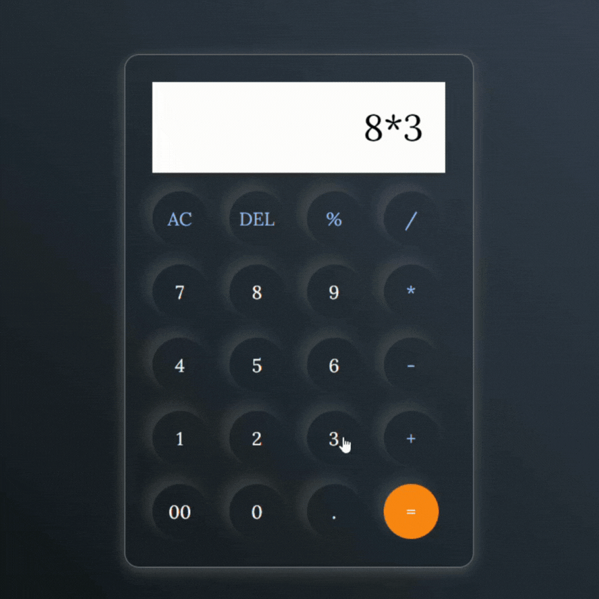

# Simple JavaScript Calculator 🖩

A lightweight calculator built with 
**HTML, CSS, and JavaScript**.  
This project demonstrates basic JavaScript operations, event handling, and simple DOM manipulation.
---
## ScreenShot
<a >
  
</a>


## Features
- Addition, Subtraction, Multiplication, Division
- Decimal support
- Clear (AC) and Delete (DEL) buttons
- Input validation with regex to prevent invalid characters
- Secure calculation using `new Function` with allowed characters only
---
## How It Works

1. User clicks buttons or numbers → added to the expression string.
2. "=" button → evaluates the expression securely.
3. "AC" button → clears all input.
4. "DEL" button → deletes the last character.
5. Input validation ensures only safe characters are evaluated.
---
## Usage
1. Clone the repository:
```bash
git clone https://github.com/yourusername/your-repo.git
